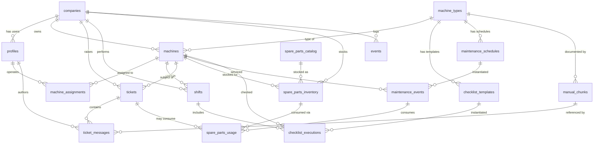

# Data Model — Single Source of Truth

**Last updated:** 07.05.2026
**Status:** MVP scope (Sprint 0 design, implemented progressively in Sprints 1–3)

This document defines the complete database schema for the MVP. **All migrations must conform to this design.** When you need to change a structure, update this document first, then write a migration.

---

## Domain Overview

NPGM Service App is a multi-tenant B2B SaaS where each **company** (mining contractor) is an isolated tenant. Within a company, **users** play different roles (operator, service engineer, project manager, company admin). They manage **machines** (mixing/charging units, drill rigs), record their daily **shifts** with charging plans, perform **checklists** (daily/weekly), schedule **maintenance**, manage **spare parts**, and exchange **tickets** with the platform's Tier 2 (the operator's own service organization, run by the platform operator).

Manuals from the equipment manufacturer (НИПИГОРМАШ) are ingested into a vector store (`manual_chunks`) for semantic search.

---

## Entity-Relationship Diagram (Mermaid)



---

## Tables

### 1. `companies`

Each row is a tenant (a mining contractor — Modern Chemical, Gulf Explosives, etc.).

```sql
create table companies (
  id          uuid primary key default gen_random_uuid(),
  name        text not null,
  country     text not null,                       -- ISO 3166-1 alpha-2: 'SA', 'AE', 'RU'
  language    text not null default 'ru',          -- preferred company-wide locale
  timezone    text not null default 'UTC',         -- IANA tz, e.g. 'Asia/Riyadh'
  created_at  timestamptz not null default now(),
  updated_at  timestamptz not null default now()
);
```

### 2. `profiles`

Extends `auth.users`. One row per user, linked to a company. **Note:** the `tier2_engineer` and `platform_admin` roles have `company_id = null` (they're not tenant users; they work cross-tenant).

```sql
create type user_role as enum (
  'operator',           -- in-field worker, mobile-first UI
  'service_engineer',   -- inside the contractor company
  'project_manager',    -- inside the contractor company
  'company_admin',      -- inside the contractor company; manages users + billing
  'tier2_engineer',     -- platform side: replies to escalated tickets
  'platform_admin'      -- platform side: full access
);

create table profiles (
  id          uuid primary key references auth.users(id) on delete cascade,
  company_id  uuid references companies(id) on delete restrict,  -- null for tier2/platform admin
  full_name   text not null,
  role        user_role not null,
  language    text not null default 'ru',
  phone       text,                                -- E.164 format, e.g. '+966XXXXXXXXX'
  created_at  timestamptz not null default now(),
  updated_at  timestamptz not null default now()
);
```

### 3. `machine_types`

Reference data — types of equipment manufactured by НИПИГОРМАШ. Seeded once.

```sql
create table machine_types (
  id              text primary key,                -- 'МЗВ', 'МСЗ', 'МСЗУ', 'МЗУ'
  name_ru         text not null,
  name_en         text not null,
  description     text,
  recipe_modes    text[] not null,                 -- e.g. {'EMULSION'} for МЗВ; {'ANFO','BLEND_70_30','EMULSION'} for МСЗУ
  created_at      timestamptz not null default now()
);
```

### 4. `machines`

Individual units of equipment owned by a company.

```sql
create type auger_position as enum ('upper', 'lower', 'none');

create table machines (
  id                uuid primary key default gen_random_uuid(),
  company_id        uuid not null references companies(id) on delete cascade,
  machine_type      text not null references machine_types(id) on delete restrict,
  model_code        text not null,                 -- e.g. 'МСЗУ-14-НПБ'
  tonnage_t         numeric(5,1) not null,         -- e.g. 14.0
  auger_position    auger_position not null default 'none',
  has_drum          boolean not null default false,
  component_count   smallint not null default 2 check (component_count between 2 and 4),
  ggd_type          text check (ggd_type in ('SN', 'acetic_acid')) ,  -- nullable
  serial_number     text,
  in_service_since  date,
  pit_location      text,                          -- where the machine is currently deployed
  engine_hours      numeric(10,2) not null default 0,
  tons_pumped       numeric(12,2) not null default 0,
  status            text not null default 'active' check (status in ('active','maintenance','decommissioned')),
  notes             text,
  created_at        timestamptz not null default now(),
  updated_at        timestamptz not null default now(),
  unique (company_id, serial_number)
);
```

### 5. `machine_assignments`

Many-to-many: which operators are assigned to which machines.

```sql
create table machine_assignments (
  machine_id   uuid not null references machines(id) on delete cascade,
  operator_id  uuid not null references profiles(id) on delete cascade,
  assigned_at  timestamptz not null default now(),
  unassigned_at timestamptz,
  primary key (machine_id, operator_id)
);
```

### 6. `manuals`

Header records for each manual file ingested.

```sql
create table manuals (
  id              uuid primary key default gen_random_uuid(),
  machine_type    text not null references machine_types(id),
  model_code      text not null,                   -- 'МЗВ-16', 'МСЗУ-14-НПБ', etc.
  language        text not null check (language in ('ru','en')),
  source_file     text not null,                   -- relative path within manuals/
  total_pages     int,
  ingested_at     timestamptz not null default now(),
  unique (model_code, language, source_file)
);
```

### 7. `manual_chunks`

Vector-indexed chunks for semantic search. **One chunk per ~300-500 tokens.**

```sql
create extension if not exists vector;

create table manual_chunks (
  id            uuid primary key default gen_random_uuid(),
  manual_id     uuid not null references manuals(id) on delete cascade,
  chunk_index   int not null,                      -- order within the manual
  page_number   int,
  section       text,                              -- e.g. 'Эксплуатация', 'ТО', 'Безопасность', 'Запчасти'
  text          text not null,
  embedding     vector(1024) not null,             -- Cohere multilingual-v3 dimensions
  created_at    timestamptz not null default now()
);

-- HNSW index for fast vector similarity search
create index manual_chunks_embedding_idx
  on manual_chunks using hnsw (embedding vector_cosine_ops);
create index manual_chunks_model_lang_idx
  on manual_chunks (manual_id);
```

### 8. `tickets`

Service tickets raised by operators or auto-generated from failed checklist items.

```sql
create type ticket_status as enum (
  'new',                  -- just created, no response yet
  'tier2_responding',     -- platform side is working on it
  'awaiting_operator',    -- waiting for operator to provide more info
  'resolved',             -- closed with a successful resolution
  'closed_self'           -- operator closed it themselves
);

create table tickets (
  id                  uuid primary key default gen_random_uuid(),
  company_id          uuid not null references companies(id) on delete cascade,
  machine_id          uuid references machines(id) on delete set null,
  operator_id         uuid not null references profiles(id) on delete restrict,
  status              ticket_status not null default 'new',
  priority            smallint not null default 3 check (priority between 1 and 5),
  title               text,                        -- auto-extracted from first message
  resolution_summary  text,
  created_at          timestamptz not null default now(),
  resolved_at         timestamptz,
  updated_at          timestamptz not null default now()
);
```

### 9. `ticket_messages`

Each message in a ticket conversation.

```sql
create type message_sender as enum ('operator', 'tier2');

create table ticket_messages (
  id                      uuid primary key default gen_random_uuid(),
  ticket_id               uuid not null references tickets(id) on delete cascade,
  sender_type             message_sender not null,
  sender_id               uuid not null references profiles(id) on delete restrict,
  text                    text,
  image_url               text,                    -- Supabase Storage path
  related_manual_chunks   uuid[],                  -- chunks attached as references
  created_at              timestamptz not null default now()
);
```

### 10. `shifts`

A daily/per-blast charging session — captures plan and actual execution.

```sql
create table shifts (
  id                    uuid primary key default gen_random_uuid(),
  company_id            uuid not null references companies(id) on delete cascade,
  machine_id            uuid not null references machines(id) on delete restrict,
  operator_id           uuid not null references profiles(id) on delete restrict,
  shift_date            date not null,
  started_at            timestamptz,
  ended_at              timestamptz,

  -- charging plan (filled at start of shift)
  plan_pit              text,
  plan_block            text,
  plan_holes_count      int check (plan_holes_count > 0),
  plan_avg_depth_m      numeric(5,2),
  plan_diameter_mm      int,
  plan_recipe           text check (plan_recipe in ('ANFO','BLEND_70_30','BLEND_30_70','EMULSION')),
  plan_tons             numeric(8,3),
  plan_engine_hours     numeric(5,2),

  -- actuals (filled at end of shift)
  fact_tons             numeric(8,3),
  fact_engine_hours     numeric(5,2),
  notes                 text,

  blocked_by_checklist  boolean not null default false,  -- true if a critical checklist item was red
  created_at            timestamptz not null default now()
);
```

### 11. `checklist_templates`

Templates per machine_type and frequency. Seeded from manuals.

```sql
create type checklist_frequency as enum ('daily', 'weekly');

create table checklist_templates (
  id              uuid primary key default gen_random_uuid(),
  machine_type    text not null references machine_types(id),
  frequency       checklist_frequency not null,
  items           jsonb not null,
  -- items shape:
  -- [
  --   {"id": "oil_level", "label_ru": "Уровень масла", "label_en": "Oil level", "severity": "critical"},
  --   ...
  -- ]
  version         int not null default 1,
  created_at      timestamptz not null default now(),
  unique (machine_type, frequency, version)
);
```

### 12. `checklist_executions`

Each instance of a completed checklist.

```sql
create table checklist_executions (
  id                uuid primary key default gen_random_uuid(),
  shift_id          uuid references shifts(id) on delete set null,
  machine_id        uuid not null references machines(id) on delete cascade,
  operator_id       uuid not null references profiles(id) on delete restrict,
  template_id       uuid not null references checklist_templates(id),
  items_status      jsonb not null,
  -- shape:
  -- [{"id": "oil_level", "status": "ok", "photo_url": null}, ...]
  -- status: 'ok' | 'warning' | 'critical'
  photos            jsonb,                         -- map of {item_id: storage_path}
  blocked_shift     boolean not null default false,
  completed_at      timestamptz not null default now()
);
```

### 13. `spare_parts_catalog`

Reference catalog of available parts per machine type.

```sql
create table spare_parts_catalog (
  id                       uuid primary key default gen_random_uuid(),
  manufacturer             text not null default 'НИПИГОРМАШ',
  part_number              text not null,
  name_ru                  text not null,
  name_en                  text not null,
  compatible_machine_types text[] not null,
  unit                     text not null default 'pcs',  -- 'pcs', 'l', 'kg', 'm'
  default_price_rub        numeric(12,2),
  notes                    text,
  created_at               timestamptz not null default now(),
  unique (manufacturer, part_number)
);
```

### 14. `spare_parts_inventory`

Stock at a company, optionally attributed to a specific machine.

```sql
create table spare_parts_inventory (
  id                    uuid primary key default gen_random_uuid(),
  company_id            uuid not null references companies(id) on delete cascade,
  machine_id            uuid references machines(id) on delete set null,  -- null = company-wide stock
  part_id               uuid not null references spare_parts_catalog(id),
  quantity              numeric(10,3) not null default 0,
  last_replenished_at   timestamptz,
  reorder_threshold     numeric(10,3),
  created_at            timestamptz not null default now(),
  updated_at            timestamptz not null default now()
);
```

### 15. `spare_parts_usage`

History of part consumption (from maintenance, repairs, tickets).

```sql
create table spare_parts_usage (
  id                      uuid primary key default gen_random_uuid(),
  inventory_id            uuid not null references spare_parts_inventory(id) on delete restrict,
  ticket_id               uuid references tickets(id) on delete set null,
  maintenance_event_id    uuid,                     -- references maintenance_events(id)
  quantity_used           numeric(10,3) not null check (quantity_used > 0),
  used_at                 timestamptz not null default now(),
  used_by                 uuid references profiles(id),
  notes                   text
);
```

### 16. `maintenance_schedules`

Reference: scheduled maintenance per machine type and node.

```sql
create type maintenance_interval_type as enum ('engine_hours', 'tons_pumped', 'calendar_days');

create table maintenance_schedules (
  id              uuid primary key default gen_random_uuid(),
  machine_type    text not null references machine_types(id),
  scope           text not null,                   -- 'engine', 'pump', 'hoses', 'forsunki', 'annual'
  name_ru         text not null,
  name_en         text not null,
  interval_type   maintenance_interval_type not null,
  interval_value  numeric(10,2) not null,
  parts_required  jsonb,
  -- shape: [{"part_number": "MX-123", "quantity": 1}, ...]
  created_at      timestamptz not null default now()
);
```

### 17. `maintenance_events`

Specific instances of scheduled maintenance.

```sql
create type maintenance_status as enum ('planned', 'in_progress', 'completed', 'skipped');

create table maintenance_events (
  id                 uuid primary key default gen_random_uuid(),
  machine_id         uuid not null references machines(id) on delete cascade,
  schedule_id        uuid references maintenance_schedules(id) on delete set null,
  planned_date       date,
  started_at         timestamptz,
  completed_at       timestamptz,
  status             maintenance_status not null default 'planned',
  parts_used         jsonb,
  notes              text,
  performed_by       uuid references profiles(id),
  created_at         timestamptz not null default now()
);
```

### 18. `events`

Application-level analytics. Append-only log.

```sql
create table events (
  id           uuid primary key default gen_random_uuid(),
  company_id   uuid references companies(id) on delete cascade,
  user_id      uuid references profiles(id) on delete set null,
  event_type   text not null,
  -- event_type examples:
  --   'ticket_created', 'manual_search_query', 'tier2_response_sent',
  --   'ticket_closed', 'checklist_completed', 'shift_started', 'shift_ended'
  payload      jsonb not null default '{}',
  created_at   timestamptz not null default now()
);

create index events_company_type_idx on events (company_id, event_type, created_at desc);
```

---

## Row-Level Security (RLS)

**RLS is enabled on every table.** Policies enforce tenant isolation: a user from Company A cannot see any data from Company B except where explicitly cross-tenant (Tier 2 sees escalated tickets but not the rest of the company's data).

### Helper function

```sql
create or replace function auth.user_company_id() returns uuid as $$
  select company_id from profiles where id = auth.uid();
$$ language sql security definer stable;

create or replace function auth.user_role() returns user_role as $$
  select role from profiles where id = auth.uid();
$$ language sql security definer stable;
```

### Policies — overview

| Table | Operator | Service Engineer | Project Manager | Company Admin | Tier 2 | Platform Admin |
|---|---|---|---|---|---|---|
| companies | own (read) | own (read) | own (read) | own (rw) | — | all (rw) |
| profiles | own (r) + same company (r) | same company (r) | same company (rw) | same company (rw) | — | all (rw) |
| machines | assigned (r) | own company (rw) | own company (rw) | own company (rw) | only related to escalated tickets (r) | all (rw) |
| machine_assignments | own (r) | own company (rw) | own company (rw) | own company (rw) | — | all (rw) |
| machine_types | r | r | r | r | r | rw |
| manuals | r | r | r | r | r | rw |
| manual_chunks | r (used for search) | r | r | r | r | rw |
| tickets | own (rw) | own company (rw) | own company (rw) | own company (rw) | only `status='new'` or `'tier2_responding'` (rw) | all (rw) |
| ticket_messages | own ticket (rw) | own company (rw) | own company (r) | own company (r) | own active ticket (rw) | all (rw) |
| shifts | own (rw) | own company (rw) | own company (rw) | own company (rw) | — | all (rw) |
| checklist_templates | r | r | r | r | r | rw |
| checklist_executions | own (rw) | own company (rw) | own company (rw) | own company (rw) | — | all (rw) |
| spare_parts_catalog | r | r | r | r | r | rw |
| spare_parts_inventory | own assigned machines (r) | own company (rw) | own company (rw) | own company (rw) | — | all (rw) |
| spare_parts_usage | r | own company (rw) | own company (rw) | own company (rw) | — | all (rw) |
| maintenance_schedules | r | r | r | r | r | rw |
| maintenance_events | own assigned (r) | own company (rw) | own company (rw) | own company (rw) | — | all (rw) |
| events | own (r) | own company (r) | own company (r) | own company (r) | own actions (r) | all (rw) |

### Sample policy implementation

The full SQL implementation lives in `db/migrations/0003_rls.sql`. Examples:

```sql
-- companies: members can read their own company
alter table companies enable row level security;

create policy companies_member_read on companies
  for select using (id = auth.user_company_id());

create policy companies_admin_write on companies
  for update using (
    id = auth.user_company_id() and auth.user_role() = 'company_admin'
  );

create policy companies_platform_admin_all on companies
  for all using (auth.user_role() = 'platform_admin');

-- machines: company members read+write own; tier2 sees only related ones via tickets
create policy machines_company_all on machines
  for all using (company_id = auth.user_company_id());

create policy machines_tier2_via_tickets on machines
  for select using (
    auth.user_role() = 'tier2_engineer'
    and exists (
      select 1 from tickets t
      where t.machine_id = machines.id
        and t.status in ('new', 'tier2_responding')
    )
  );
```

---

## Indexes (beyond primary keys)

```sql
-- Multi-tenant filtering
create index profiles_company_idx on profiles (company_id);
create index machines_company_idx on machines (company_id);
create index tickets_company_status_idx on tickets (company_id, status, created_at desc);
create index shifts_company_date_idx on shifts (company_id, shift_date desc);
create index inventory_company_machine_idx on spare_parts_inventory (company_id, machine_id);
create index events_company_type_idx on events (company_id, event_type, created_at desc);

-- Search
-- (manual_chunks_embedding_idx already defined above)

-- Hot lookups
create index ticket_messages_ticket_idx on ticket_messages (ticket_id, created_at);
create index machine_assignments_operator_idx on machine_assignments (operator_id) where unassigned_at is null;
```

---

## Migration Order

Migrations are numbered and applied in order. Each migration is idempotent where possible.

| # | File | Contents |
|---|---|---|
| 0001 | `0001_init.sql` | Extensions (pgcrypto, vector), `companies`, `machine_types`, helpers (`auth.user_company_id`, `auth.user_role`) |
| 0002 | `0002_users.sql` | `user_role` enum, `profiles`, profile trigger on `auth.users` insert |
| 0003 | `0003_machines.sql` | `machines`, `machine_assignments` |
| 0004 | `0004_manuals.sql` | `manuals`, `manual_chunks` (with HNSW index) |
| 0005 | `0005_tickets.sql` | `tickets`, `ticket_messages` enums and tables |
| 0006 | `0006_shifts.sql` | `shifts` |
| 0007 | `0007_checklists.sql` | `checklist_templates`, `checklist_executions` |
| 0008 | `0008_parts.sql` | `spare_parts_catalog`, `spare_parts_inventory`, `spare_parts_usage` |
| 0009 | `0009_maintenance.sql` | `maintenance_schedules`, `maintenance_events`; FK back from `spare_parts_usage` |
| 0010 | `0010_events.sql` | `events` table |
| 0011 | `0011_rls.sql` | Enable RLS + policies on all tables |
| 0012 | `0012_indexes.sql` | All non-PK/UQ indexes |

**Seed data:**
- `seed/0001_machine_types.sql` — 4 base types (МЗВ, МСЗ, МСЗУ, МЗУ)
- `seed/0002_test_companies.sql` — fake companies for development (gated to dev environments)

---

## Known Constraints / Decisions

1. **No biometric data, no card data.** Out of scope. No PCI / GDPR-special category data.
2. **`auth.users` is owned by Supabase**, we extend via `profiles`. Trigger creates `profiles` row on signup but with `company_id = null`; it gets filled during onboarding.
3. **Soft-delete vs hard-delete:** machines have `status='decommissioned'` to preserve history; users are hard-deleted via cascade. Tickets and shifts never deleted (audit trail).
4. **Multi-tenant cross-checks:** every FK that crosses tables within the same tenant has a matching `company_id` column on both sides + a CHECK constraint added in `0011_rls.sql` to prevent cross-tenant references.
5. **Vector dimension (1024):** matches Cohere `embed-multilingual-v3` output. If we later switch to BGE-M3 (also 1024) — no schema change needed.

---

## Open questions for the team

- ✅ Service-role key handling — answered (only in backend `.env`, never frontend).
- ⏳ Backup strategy beyond Supabase's daily snapshots — to decide before production.
- ⏳ Audit log granularity (who deleted what, when) — basic via `events`, full audit log is v2.
